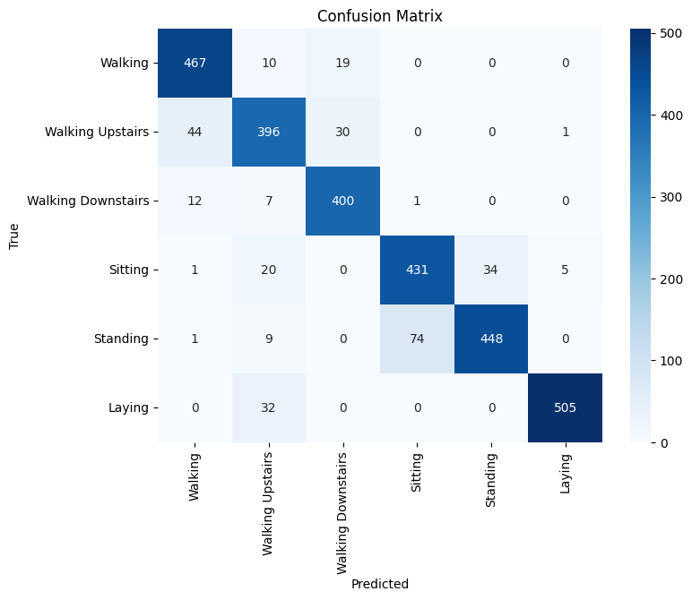
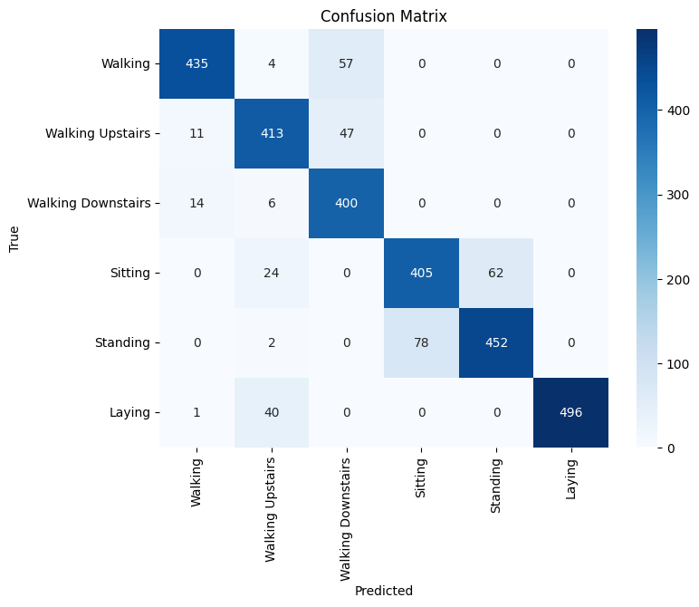
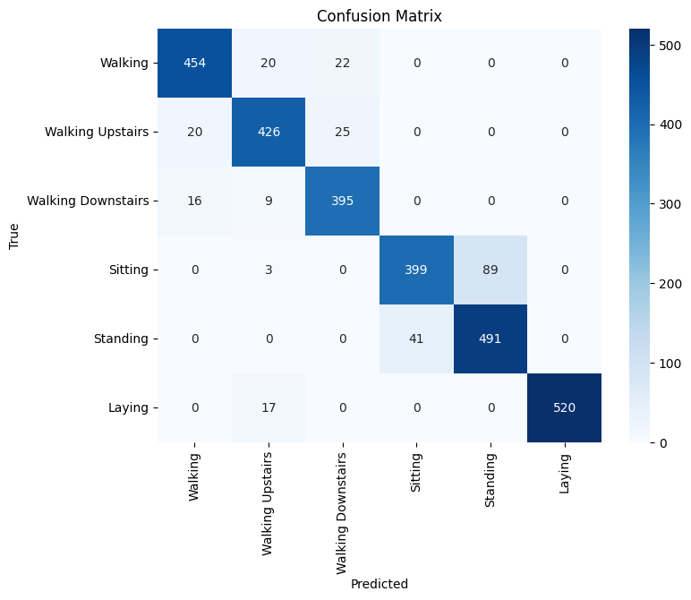
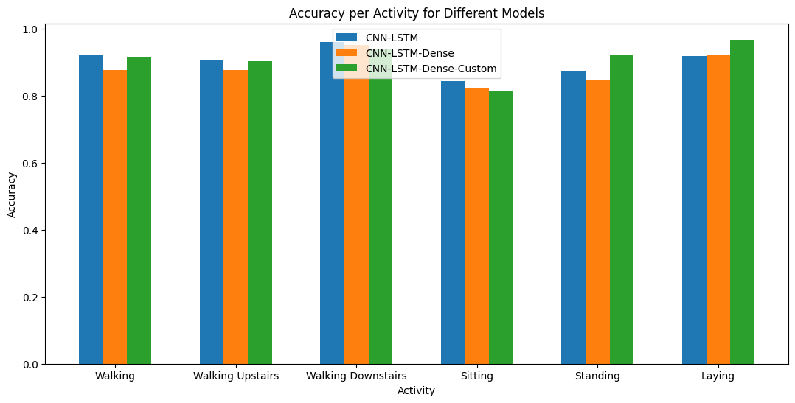
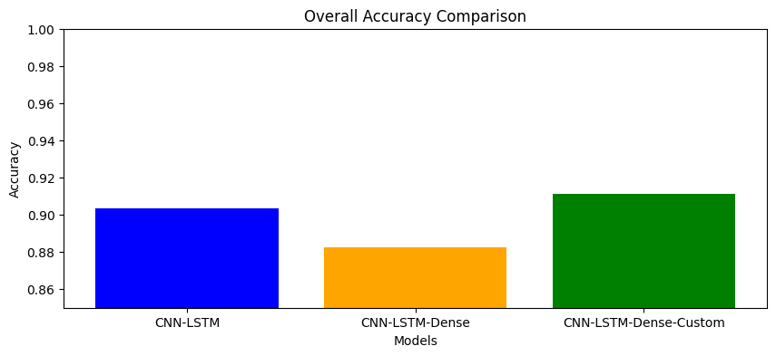
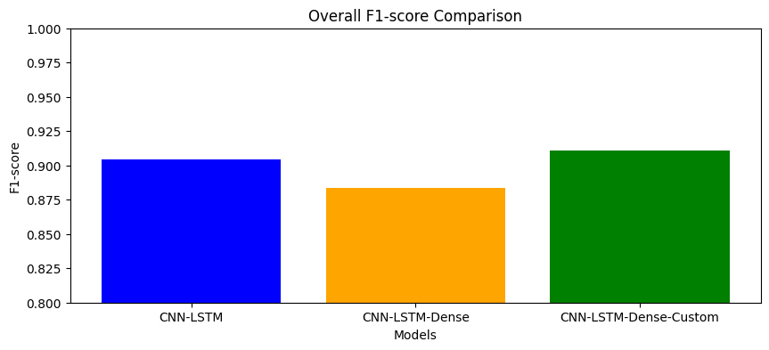
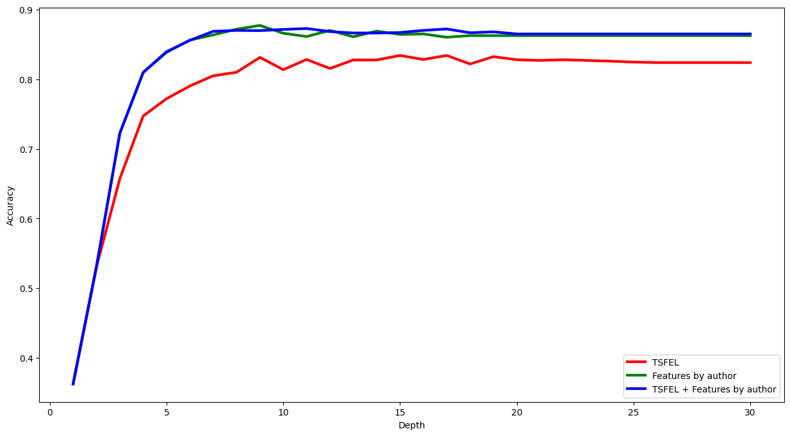
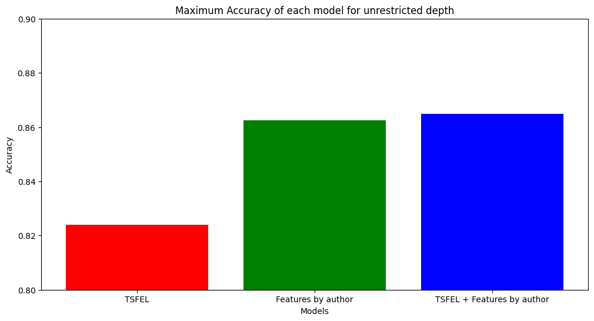
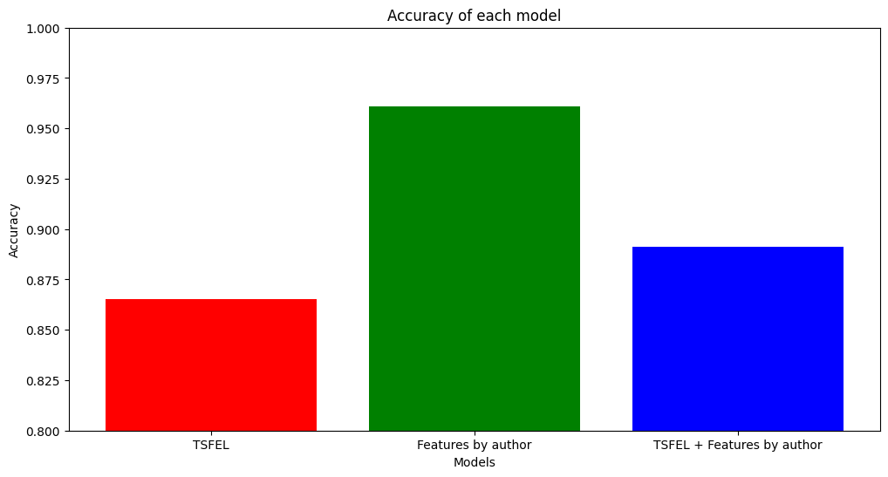
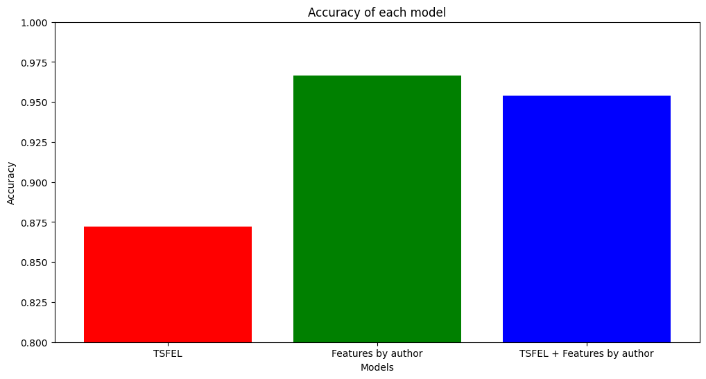

# Report of Models for UCI-HAR

## Deep Learning Models on inertial signals
### Model-1: LSTM network with inerital signals
Here idea was to use LSTM network and train it using the inertial signal. As LSTMs have gating mechanism which helps to regulate the flow of information and which is effective in the predition of time series data.

**Preparation of Training data for this network**
- I just stacked the inertial signal given in the dataset. Which included acceleration and gyro in all three axes.
- The size of X_train was (7352, 128, 6) and X_test was (2947, 128, 6)

**Model**
```
class LSTMModel(nn.Module):
    def __init__(self, input_size, hidden_size, num_layers, num_classes):
        super(LSTMModel, self).__init__()
        self.lstm = nn.LSTM(input_size, hidden_size, num_layers, batch_first=True)
        self.fc = nn.Linear(hidden_size, num_classes)

    def forward(self, x):
        h0 = torch.zeros(num_layers, x.size(0), hidden_size).to(x.device)
        c0 = torch.zeros(num_layers, x.size(0), hidden_size).to(x.device)
        out, _ = self.lstm(x, (h0, c0))
        out = self.fc(out[:, -1, :])
        return out
```
The model has the first layer as LSTM network followed by the fully connected layer. In the forward pass, we defined h0 and c0 which are the initial hidden state and initial cell state for the LSTM.

**Training**
- I first trained this model using the raw inertial signal i.e. the X_train given above.
- Then I introduced two more features which were total acceleration $= \sqrt{acc_x^2 + acc_y^2 + acc_z^2}$ and similar for total gyro.
- Then the model was trained on there custom features

**Evaluations**
- After 100 epochs the loss got saturated.
- On the test data model with inertial signal gave accuracy as $\approx40.41\%$
- The model with custom features gave $\approx41.50\%$

**Reasons for bad accuracy**
- LSTMs are good at capturing temporal dependencies but struggle when the raw input lacks extracted features.
- Directly feeding raw sensor data without preprocessing forces LSTM to learn both feature extraction and temporal dependencies, which is inefficient.

--- 

### Model-2: CNN-Dense model
Here, idea is to do 1D Convolutions first and then add neural network layer on top of it. Model is expected to perform better because of 1D Conv as convolutions can help model to extract features from a window of certain size rather than only one timestamp.

**Dataset**
- For this model, I have prepared two datasets.
  - Using all the 9 inertial signals.
  - Using 9 inertial signals with total acceration, total gyro, acceleration SMA and gyro SMA. SMA stands for Signal Magnitude Area which is the sum of acceleration and gyro over three axes respectively.

**Model**
```
def create_cnn_dense(input_shape, num_classes):
    model = Sequential([
        Input(shape=input_shape),
        Conv1D(filters=16, kernel_size=3, activation='tanh'),
        MaxPooling1D(2),
        Conv1D(filters=32, kernel_size=3, activation='relu'),
        MaxPooling1D(2),
        Flatten(),
        Dense(128, activation='relu'),
        Dense(64, activation='relu'),
        Dense(num_classes, activation='softmax')

    ])
    return model

```
**Model Summary:**
```
Model: "sequential"
┏━━━━━━━━━━━━━━━━━━━━━━━━━━━━━━━━━━━━━━┳━━━━━━━━━━━━━━━━━━━━━━━━━━━━━┳━━━━━━━━━━━━━━━━━┓
┃ Layer (type)                         ┃ Output Shape                ┃         Param # ┃
┡━━━━━━━━━━━━━━━━━━━━━━━━━━━━━━━━━━━━━━╇━━━━━━━━━━━━━━━━━━━━━━━━━━━━━╇━━━━━━━━━━━━━━━━━┩
│ conv1d (Conv1D)                      │ (None, 126, 16)             │             448 │
├──────────────────────────────────────┼─────────────────────────────┼─────────────────┤
│ max_pooling1d (MaxPooling1D)         │ (None, 63, 16)              │               0 │
├──────────────────────────────────────┼─────────────────────────────┼─────────────────┤
│ conv1d_1 (Conv1D)                    │ (None, 61, 32)              │           1,568 │
├──────────────────────────────────────┼─────────────────────────────┼─────────────────┤
│ max_pooling1d_1 (MaxPooling1D)       │ (None, 30, 32)              │               0 │
├──────────────────────────────────────┼─────────────────────────────┼─────────────────┤
│ flatten (Flatten)                    │ (None, 960)                 │               0 │
├──────────────────────────────────────┼─────────────────────────────┼─────────────────┤
│ dense (Dense)                        │ (None, 128)                 │         123,008 │
├──────────────────────────────────────┼─────────────────────────────┼─────────────────┤
│ dense_1 (Dense)                      │ (None, 64)                  │           8,256 │
├──────────────────────────────────────┼─────────────────────────────┼─────────────────┤
│ dense_2 (Dense)                      │ (None, 6)                   │             390 │
└──────────────────────────────────────┴─────────────────────────────┴─────────────────┘
```
The model has a 1D Convolution layer, with activation of $\tanh$, followed by max-pooling of size 2. Again, I did 1D Convolution and followed by max-pooling of size 2. Then flattening the data and sending it to final two fully connected layers of size 128, and 64 with activation of ReLU. 

**Perfomance on Inertial Data Only**
```
- Accuracy:  0.9013
- Precision: 0.9040
- Recall:    0.9013
- F1 Score:  0.9017
```


**Performance on Inertial + Custom features**
```
- Accuracy:  0.8982
- Precision: 0.9000
- Recall:    0.8982
- F1 Score:  0.8983
```



---

### Model-3: CNN-LSTM network
This model will begin with a 1D convolutional layer  with 64 filters and a kernel size of 3, followed by a max-pooling layer and flattening. To maintain the temporal structure of the data, all convolutional layers will be wrapped in a TimeDistributed layer, which takes reshaped input signals (from (None, 128, 9) to (None, 4, 32, 9)). The extracted features will then be passed to an LSTM layer with 128 units to capture temporal dependencies, followed by a fully connected layer with a softmax activation for 6-class classification.

**Model 3.1: CNN-LSTM Network**
```
def create_model(input_shape, num_classes):
    model = Sequential([
        Input(shape=input_shape),

        TimeDistributed(Conv1D(64, 3, activation='relu')),
        TimeDistributed(MaxPooling1D(2)),
        TimeDistributed(Flatten()),

        LSTM(128, activation='tanh'),

        Dense(num_classes, activation='softmax')
    ])

    return model
```

**Model Summary**
```
┏━━━━━━━━━━━━━━━━━━━━━━━━━━━━━━━━━━━━━━┳━━━━━━━━━━━━━━━━━━━━━━━━━━━━━┳━━━━━━━━━━━━━━━━━┓
┃ Layer (type)                         ┃ Output Shape                ┃         Param # ┃
┡━━━━━━━━━━━━━━━━━━━━━━━━━━━━━━━━━━━━━━╇━━━━━━━━━━━━━━━━━━━━━━━━━━━━━╇━━━━━━━━━━━━━━━━━┩
│ time_distributed_12                  │ (None, 4, 30, 64)           │           1,792 │
│ (TimeDistributed)                    │                             │                 │
├──────────────────────────────────────┼─────────────────────────────┼─────────────────┤
│ time_distributed_13                  │ (None, 4, 15, 64)           │               0 │
│ (TimeDistributed)                    │                             │                 │
├──────────────────────────────────────┼─────────────────────────────┼─────────────────┤
│ time_distributed_14                  │ (None, 4, 960)              │               0 │
│ (TimeDistributed)                    │                             │                 │
├──────────────────────────────────────┼─────────────────────────────┼─────────────────┤
│ lstm_4 (LSTM)                        │ (None, 128)                 │         557,568 │
├──────────────────────────────────────┼─────────────────────────────┼─────────────────┤
│ dense_12 (Dense)                     │ (None, 6)                   │             774 │
└──────────────────────────────────────┴─────────────────────────────┴─────────────────┘

```

**Performance Metrics**
This model was trained on the inertial signals only.
```
Accuracy:  0.9036
Precision: 0.9064
Recall:    0.9036
F1 Score:  0.9041
```

---
**Model 3.2: CNN-LSTM-Dense Network**
- In this model I have added two fully connected hidden layers of size 64 and 32 with ReLU activation for both.
- This model was also trained on the Inertial Signals only

**Performance Metrics**
```
Accuracy:  0.8826
Precision: 0.8876
Recall:    0.8826
F1 Score:  0.8835
```


---

**Model 3.3 CNN-LSTM Dense with custom features**
- This model has same architecture as the previous one.
- Only difference is that this was trained on the additional features created i.e. total acceleration and gyro and SMA of both.

**Performance Metrics**
```
Accuracy:  0.9111
Precision: 0.9128
Recall:    0.9111
F1 Score:  0.9111
```


---

### Comparision of all three CNN-LSTM networks
**Improvements Due to 1D CNN:**

- **Feature Extraction**: CNN helps in learning local patterns from inertial signals before LSTM processes the sequence.
- **Reduces Noise**: CNN filters irrelevant variations. They make it easier for LSTM to learn meaningful temporal relationships.
- **Spatial Awareness**: 1D CNN captures short-term dependencies effectively which LSTM can then model over time.


Once the CNN extracts meaningful features, LSTM can focus on learning long-term dependencies instead of struggling with raw data.
This leads to better sequence modeling and improved classification performance. Also we have added dense layer which helped in capturing complex feature relationships after LSTM processing. It acts as a fully connected decision-making layer, improving final classification performance.


---

---


## Decision Trees, Logistic Regression, SVM on featurized data.
### Creating Features using TSFEL
- The author has provided us 561 features. Now I have created some more features using the TSFEL library. Here is the list:
  - positive_turning
  - negative_turning
  - spectral_centroid
  - spectral_distance
  - spectral_slope
  - spectral_rolloff
  - spectral_rollon
  - pk_pk_distance
  - rms
  - slope
  - neighbourhood_peaks
  - zero_cross
- These features are created using the inertial signals. 
- We have 9 inertial signals and here are 12 features so in total we got 108 new features.
- Now I have trained Decision tree classifier, Logistic Regression and SVM for the prediction. I have used three types of dataset, TSFEL only, Features by author and combined.

---

### Decision Tree
- I have trained decision trees with varying depth and here is the plot of accuracy on the test dataset.
 

- The accuracy seems to be saturated after the depth 20.
- Overall combined dataset has performed well which was the expected behaviour.
- Here is the comparision of accuracies when we didn't restricted the Decision Tree Depth 



### Logistic Regression

Similarly a logistic regression was trained on all three datasets. It gave $\approx96.09\%$ accuracy on the features by author dataset. Below is the plot of comparisions. The less accuracy on the combined dataset might be the effect of overfitting.



### SVMs
SVMs gave $\approx96.67\%$ accuracy on the features by author dataset and $\approx95.38\%$ accuracy on the combined dataset which is comparable. Here is the comparision plot of the three models.

